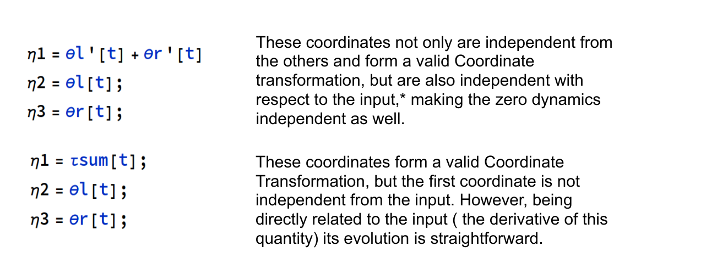

# Robots Control Project: Tavola 2 e 3

## Table of Content

- [Robots Control Project: Tavola 2 e 3](#robots-control-project-tavola-2-e-3)
  - [Table of Content](#table-of-content)
  - [Introduction](#introduction)
  - [Inverse spherical anolonome pendulum](#inverse-spherical-anolonome-pendulum)
    - [Non Minimal state representation](#non-minimal-state-representation)
    - [No slip condition and Non holonomic constraints](#no-slip-condition-and-non-holonomic-constraints)
    - [Minimal State representation](#minimal-state-representation)
    - [Parameters](#parameters)
    - [Direct Kinematics](#direct-kinematics)
    - [Kinetic Energy](#kinetic-energy)
    - [Potential Energy and Lagrangian formulation for the Equations of motion](#potential-energy-and-lagrangian-formulation-for-the-equations-of-motion)
    - [Equations of motion and Free motion simulation](#equations-of-motion-and-free-motion-simulation)
    - [Controllability and Accessibility](#controllability-and-accessibility)
    - [Osservability](#osservability)
    - [Feedback Linearization in MIMO systems](#feedback-linearization-in-mimo-systems)
    - [MIMO Feedback Linearization for the Spherical Inverted Pendulum](#mimo-feedback-linearization-for-the-spherical-inverted-pendulum)
      - [The Linearizing Input](#the-linearizing-input)
      - [Zero Dynamics and Linear System preliminary analysis](#zero-dynamics-and-linear-system-preliminary-analysis)
    - [Results](#results)
    - [Different Initial Contidions](#different-initial-contidions)
    - [Conclusions and Improvements](#conclusions-and-improvements)
- [Appendix A: Code Structure](#appendix-a-code-structure)

  <!--  -->
  
    <figcaption  align="Center"> Fig.1 - Anolonome Spherical Inverted pendulum.</figcaption>

## Introduction

The problem of balancing an inverted pendulum has attracted the attention of control researchers in recent decades. There exist a wide variety of inverted-pendulum-type systems, such as the pendubot, the acrobot, the pendulum on a cart, the inertial wheel pendulum and the Furuta pendulum. All these systems are under-actuated, that is, they are systems with fewer actuators than degrees of freedom.

This work deals with the modelling and control of a spherical inverted pendulum (SIP), which is another member of the family of inverted pendulum systems with degree of under-actuation of two.

The system consists of a rigid rod coupled in its base to an under-actuated universal joint in such a way that the extreme of the rod moves over a spherical surface with its centre at the base of the rod (see Figure 1). As such, through the motion of the base of the pendulum on the horizontal plane it is possible to balance the extreme of the rod in its upright position.

## Inverse spherical anolonome pendulum

The Spherical anolonome inverted pendulum is a underactuated system with 4 dof. 
- Two rotations are needed to describe the pose of the pendulum on a spherical surface (the third angle is not necessary as it is an symmetry axes for the pendulum) 
- Two coordinates are needed for the bases of the pendulum (eg. the angles of the two wheels).

There are multiple ways to parametrize the state, but the main choiche is wether to choose a minimal or a non minimal state representation.

### Non Minimal state representation

In this case the state would be:

<!-- $$q(t)=\{\theta_r,\theta_l,\psi,\phi,x,y,\theta\}$$ -->

In this case it would be easier to compute the direct kinematic as many quantities would be related directly to x and y.

If a system is parametrized with m m coordinates but only has n (n < m ) dof; then, there should exist p=m−n constraints which allow the reduction of the order of the system from m to n; in others words, if we choose n independent joint variables there must exist p dependent joint variables.

In this case the constraints is a non slip non differentiable constraint, which will be modelled in the next section.
### No slip condition and Non holonomic constraints

 <!-- The constraints are rolling without slipping for the two wheels. This results in $x,y$ and $\theta$ being excluded from the state and only related to $\theta_r, \theta_l$ with the following relationship: -->

<!-- $$\theta =\frac{r (\theta_r(t)-   \theta_l(t)}{l_{a}}$$

$$\dot x=\frac{r \cos (\theta ) (\dot     {\theta} r(t)-\dot{\theta}l(t))}{2} $$

$$\dot y=\frac{r \sin (\theta ) (\dot     {\theta} r(t)-\dot{\theta}l(t))}{2} $$ -->

### Minimal State representation

Explicitly modelling the constraints allows a minimal state representation. In this case the configuration would be:

<!-- 
$$\theta_r(t):\text{left wheel}                                 $$
$$\theta_{l}(t): \text{right wheel}                             $$
$$\psi (t): \text{X rotation in the XYZ parametrization}        $$
$$\phi (t): \text{Y rotation in the XYZ parametrization}        $$ -->

So that the resulting minimal representation is:

<!-- 
$$q(t)=\left\{\theta_r(t),\theta_l(t),\psi (t),\phi (t)\right\}$$

$$\dot q(t)=\{\dot{\theta_r}(t),\dot{\theta}_{l}(t),\dot{\psi}(t),\dot{\phi}(t)\}$$ -->

### Parameters

Just for reference, the used parameters:
<!-- 
$$G\to 9.81,m_p\to 1      ,m_a\to 1      ,m_r\to 0.5    ,l_p\to 0.7    ,l_a\to 1      ,r\to 0.3            ,I_a\to 0.8$$ -->

### Direct Kinematics

The direct kinematics problem consists in finding expressions for the pose (i.e., position and orientation) variables of an element of interest of the system, described by the vector x in terms of the actuated joint variables; this can be expressed as

<!-- $$x=f(q,β(q))$$
	

In addition, by taking the time derivative of the previous equation we get the so-called differential kinematics equation

$$\dot x=J(ρ)\dot q$$

where 
$$J(ρ)=∂f(q,β(q))∂q$$

On the other hand, the inverse kinematics problem consists in establishing the value of the actuated joint coordinates that correspond to a given pose of the element of interest, and can be expressed as

$$q=f^{-1}(x)$$ -->
	

The inverse kinematics problem can be solved in general form by geometric or analytic approaches.

The direct kinematic process explicitated for the Spherical inverted pendulum is the following:

<!-- - $O$ center of the wheels axis $\{$ $x,y,0\}$ 
- $OP$ center of mass of the pendulum
- $v_{rl}$: velocity of the center of mass of the left wheel
- $v_{rr}$: velocity of the center of mass of the right wheel
- $v_{p}$: velocity of the center of mass of the pendulum
- $v_a$: velocity of the wheel axis
- $\omega P_{g}$: angular velocity of pendulum in fixed frame
- $\omega P_{p}$: angular velocity of pendulum in pendulum frame
- $x$: velocity of the center of mass of the left wheel
- $y$: velocity of the center of mass of the left wheel
- $\theta$: velocity of the center of mass of the left wheel
  -->
The velocity of the wheels are easy to obtain from state coordinates through the no slip condition:

<!-- $$ v_a=\{ \dot x, \dot y, 0\}^T$$

 $$v_{rl}=r  \dot{\theta}_l(t);$$

$$v_{rr} =r \dot{\theta}_r(t) ;$$
 

$$R_p=R_x(\psi (t)).R_y(\phi (t)).R_z(\eta (t));$$

$$\omega P_g=\dot \eta (t) R_x(\psi (t)) R_y(\phi (t)) \times \{0,0,1\}+\dot \phi (t) R_x(\psi (t))\times \{0,1,0\}+\{1,0,0\} \dot \psi (t);$$ -->

<!-- $$\omega P_s=\dot \psi (t) (R_y}(\phi (t)).R_z(\eta (t)))^T {1,0,0\}+\dot \phi (t) Rz}(\eta (t))^T.\{0,1,0\}+\{0,0,1\} \eta '(t)$$ -->

<!-- $$ v_p = v_a + \omega P_g \times AP$$ -->

### Kinetic Energy

<!-- $$E_{tot}=E_{p2}+E_{a1}+E_{a2}+E_{wl1}+E_{wr1}+E_{wl2}+E_{wr2} $$
$$E_{p1}=\frac{m_p  v_P^T v_P}{2}$$
$$E_{a2}=\frac{I_{a} \theta^2  }{2} $$
$$E_{p2}=\frac{1}{2}   \omega P_s J_{pg} \omega P_s$$
$$E_{a1}=\frac {m_{p}  v_{a}   v_{a}}{2}$$
$$E_{wl2}=\frac{w_{rr}J_{r}    w_{rr}}{2}$$
$$E_{wr2}=\frac{w_{rl} J_{r}   w_{rl}}{2}$$
$$E_{wl1}=\frac{m_{r}  v_{rr}^2}{2}; $$
$$E_{wr1}=\frac{m_{r}  v_{rl}^2}{2}$$ -->

### Potential Energy and Lagrangian formulation for the Equations of motion

<!-- $$ mpgz_p $$

$$ L=E_{tot}-U $$ -->

### Equations of motion and Free motion simulation
The symbolic form for the equations of motion is not reported here as they would require too much space. A full symbolic formulation can be found in the Wolfram Notebook under the variable DynLeftTerm [[5:9]]

The best way to understand if the equation of motion found are correct is to simulate with an ODE solver the equations of motion from different starting conditions and verify if the system behaves in a physically plausible way. 
In this case I tried to simulate the system starting near the upright position, and the result is the following:

<!-- $$ \frac{\partial }{\partial t}\frac{\partial L}{\partial \text{qd}(t)}-\frac{\partial L}{\partial q(t)}=\tau_q$$

$$\tau_q=\{0, 0,0,0,\tau_r, \tau_l,0 ,0\}^T$$  -->

### Controllability and Accessibility

<!-- The controllability of the non linear system can be analyzed starting from the Chow's theorem, that states: A system is small time locally accessile in $x_0 \in \mathbb{R} ^n$ if, given the system  -->

and the distributions: 

<!-- the smallest $\Delta$-invariant containing+ $\Delta_0$, which is $< \Delta | \Delta_0>$, has dimensions $n$ in $x_0$.
The dimensions of  $< \Delta | \Delta_0>$ can be computed using the filtration procedure, for which the following quantity must be computed iteratively: -->

<!-- where  $[\Delta_i, \Delta]$ represent the Lie Bracket between the vector fields of the two distributions. The procedure is arrested when k is found such that the two distributions $\Delta_k$ e $\Delta_{k+1}$ are non singular in $x_0$ and $\dim \Delta_k(x_0) = \dim \Delta_{k+1}(x_0)$. -->

In my system: 

<!-- Applying the filtration procedure to these distributions, which has been implemented symbolically in Wolfram Mathematica, I can compute the dimension of the $\Delta_k$. The dimension of $\Delta_2$ is 8 in the pendulum upright position (interest point for the system), meaning that the sistem is small time locally accessible. -->

The distributions are not represented here for clarity, as the symbolic output is too big to be visualized correctly in Mathematica. The symbolic variable is saved in the Mathematica Notebook as observability_symbolic_system

### Osservability

<!-- To study the observability of a system there are three different approaches.. Analougously to the controllability case, a filtration procedure between the co-distribution $\Omega_0 = \frac{\partial h(x)}{\partial x}$ and the distribution $\Delta = span\{f(x), g_1(x),...,g_m(x)\}$ 
\\ -->

<!-- The procedure is identical in this case, except for the fact that the Lie Bracket is now between a covector field $\Omega_k$ and the vector fields $\Delta$

Using the implemented algorithm on the systems distributions the dimension of  $\Omega_2$ seems to have dimension $8$, making the system observable. -->

### Feedback Linearization in MIMO systems

The standart theory for MIMO feedback linearization for a non linear square system is here reviewed. 

Given the affine in control MIMO system:

The outputs can be derived untill the inputes are explicitly found:

Considering only the higher order derivatives of the ouputs, the terms can be rearranged in the following system:

Which can be rewritten in the compact form:

A coordinate transformation is thus found. The first r coordinates are:

While other n-r independent coordinates must be found to complete the coordinate transformation:

The coordinate change is now complete, and the new variables in which the dynamic is written are:

The feedback linearization problem can now be reduced to finding 

such that using the following input:

The dynamics in the new variables is linear:

Choosing carefully the gains of the new "virtual" input makes the new linear system asyntotically stable.

The resulting zero dynamics (the dynamics of the remaining variables) will be:

<!-- In this case the two outputs chosen for feedback linearization are the two angles: $\phi$ and $\psi$. -->

### MIMO Feedback Linearization for the Spherical Inverted Pendulum

Here, the MIMO Feedback procedure described above is applyed to the Spherical Inverted Pendulum.

On the left, the system in affine form is presented.
At the bottom, we have the chosen Input, Output and the resulting g matrix.

The procedure starts with taking the Lie Brackets of f with respects to the Inputs, untill the input is present.
Deriving two times, we see that only one of the input is in the Lie Brackets:

This is the same thing that happens with the unicycle, and the physical explanation is that while the sum of the torques at the two wheels determines an immediate effect on the dynamics, the difference if the torque is responsible for the steering, which enters the dynamics with a delay.

The same "trick" that is done in the unicycle system is useful here: State Augmentation. By introducing a new variable into the state and modifying the input to be the derivative of that variable solves the problems, and the state thus become:

At this point, the Lie Bracket can be succesfully computed and contains both the inputs. 

The outputs derivative explicit formulations is therefore:

The system can be written in compact form:

The coordinate change so far is: 

In order to find the other three coordinates there are two options.
These are:

The first one is chosen, so that the zero dynamics is independent from the input.

#### The Linearizing Input 

Now that we have a valid coordinate transformation the new system can be written and the linearizing input can be found. Choosing proper gains for the linear system we have:

#### Zero Dynamics and Linear System preliminary analysis

By using the previously found input and solving the system dynamics in a ode solver for near upright pendulum initial position we can study the dynamics of the Linear System (asymptotically stable, on the left), and the zero dynamics (on which we have no control).

### Results

The variables represented here are the 1st, 2nd, 4th and 5th (as the 3rd and 6th variables from the coordinate change are huge symbolic variables which are not directly meaningful like the angles and their derivatives).

It is clear how a linear behaviour depending on the pole placement procedure implicitly done while choosing the gains for the linearizing feedback gains is obtained. The Zero dynamics on the other hand has not a linear behaviour and there is no control over the actual zero dynamic variables from the coordinate change. This can be problematic if there is the need to control the position or the angular position of the wheels.

We can now analyze the behaviour of the controller. When the initial angular velocity of the pendulum is zero the controller tries to align the wheels so that the axel is perpendicular to the plane in which the pendulum is falling (pfp- pendulum fall plane), and then compensates the fall by accellerating or decellerating. In this case, the initial angular velocity is not null so the base is not perfectly aligned to the pfp. The behaviour will be investigated more in the next section.

### Different Initial Contidions

The pendulum is stabilized in the upright position regardless of the initial conditions.

The system is now simulated with the following initial conditions:

The conterintuitive behaviour in the 3rd simulation is due to the significative initial angular velocity of the pendulum.

<!-- However, with the current approach, we don't have any control on the x-y position of the pendulum and technically we can't bring the pendulum in upright position if it starts in the down position.

For that, an hybrid approach is needed: A swing up controller should bring the pendulum near the upright position where a feedback linearization controller would stabilize the pendulum. -->

### Conclusions and Improvements

While a Feedback Linearization controller for the Spherical Inverted Pendulum has been succesfully designed, there are still some problems that would be worth considering:
First of all, with the current formulation there is no real control over the Pendulum position in space, nor its vicinity to the origin.

A nice try would be to synthesize a feedback linearization controller based on other ouputs such as Energy and Norm of the polar distance from the origin.

A second problem is that the the system is not robust to every initial condition. When the feedback linarization controller starts from the pendulum down position (or the bottom half sphere), the required torque is infinite making the dynamics explode. 
For this reason it is necessary to synthesize the hybrid controller based on a swing up phase connected to the actual feedback linearizing controller. 
Also, it would be nice to compare the performances of these controller to an Optimal Control controller which could control the system over predefined trajectories solving non linear constrained optimization problems.

Having modelled both a 2D double inverted pendulum and the Spherical Inverted Pendulum, one thing is clear: 3D rotations do introduce a lot of computational burden for most operations: Observability and Reachability took considerably longer than the 2D case, the Dynamic Inversion could not be simplified symbolically and the filtration procedure couldn't even print the output as it exceeded the limit dimension of Wolfram.

This really gives an hint on how difficult is to control real time complex system that requires heavy 3D computations such as Humanoids and Quadruped robots.

# Appendix A: Code Structure

The code structure will here be quickly commented and only the less obvious will be commented more in detail:

All the sections have a structure similar to these:

- Initialization: where the minimal state representation is initialized

-Constraints Modelling:

In the following section the non linear algorithms necessary to compute the filtration procedure and all the operations (Lie Bracket between vectors, scalars and covectors) have been implemented and tested on simpler system before using them on the real 3D Spherical Inverted Pendulum.

The implementations are in the form:

- Non Linear System Analysis, where the affine control form is defined: 

And where the quantities for the filtration procedure are computed:

With the results:

- The Feedback Linearization section:

With the coordinate change:

And the feedback linearizing input computation:

- Equations of Motion solution

- And Finally, the 3D Simulation

