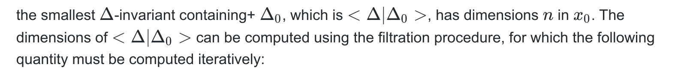

# Robots Control Project: Tavola 2 e 3

## Table of Content

- [Robots Control Project: Tavola 2 e 3](#robots-control-project-tavola-2-e-3)
  - [Table of Content](#table-of-content)
  - [Introduction](#introduction)
  - [Inverse spherical anolonome pendulum](#inverse-spherical-anolonome-pendulum)
    - [Non Minimal state representation](#non-minimal-state-representation)
    - [No slip condition and Non holonomic constraints](#no-slip-condition-and-non-holonomic-constraints)
    - [Minimal State representation](#minimal-state-representation)
    - [Parameters](#parameters)
    - [Direct Kinematics](#direct-kinematics)
    - [Kinetic Energy](#kinetic-energy)
    - [Potential Energy and Lagrangian](#potential-energy-and-lagrangian)
    - [Equations of motion and Free motion simulation](#equations-of-motion-and-free-motion-simulation)
    - [Controllability and Accessibility](#controllability-and-accessibility)
    - [Osservability](#osservability)
    - [Feedback Linearization in MIMO systems](#feedback-linearization-in-mimo-systems)

  <!--  -->
  
    <figcaption  align="Center"> Fig.1 - Anolonome Spherical Inverted pendulum.</figcaption>

## Introduction

The problem of balancing an inverted pendulum has attracted the attention of control researchers in recent decades. There exist a wide variety of inverted-pendulum-type systems, such as the pendubot, the acrobot, the pendulum on a cart, the inertial wheel pendulum and the Furuta pendulum. All these systems are under-actuated, that is, they are systems with fewer actuators than degrees of freedom.

This work deals with the modelling and control of a spherical inverted pendulum (SIP), which is another member of the family of inverted pendulum systems with degree of under-actuation of two.

The system consists of a rigid rod coupled in its base to an under-actuated universal joint in such a way that the extreme of the rod moves over a spherical surface with its centre at the base of the rod (see Figure 1). As such, through the motion of the base of the pendulum on the horizontal plane it is possible to balance the extreme of the rod in its upright position.

## Inverse spherical anolonome pendulum

The Spherical anolonome inverted pendulum is a underactuated system with 4 dof. 
- Two rotations are needed to describe the pose of the pendulum on a spherical surface (the third angle is not necessary as it is an symmetry axes for the pendulum) 
- Two coordinates are needed for the bases of the pendulum (eg. the angles of the two wheels).

There are multiple ways to parametrize the state, but the main choiche is wether to choose a minimal or a non minimal state representation.

### Non Minimal state representation

In this case the state would be:

<!-- $$q(t)=\{\theta_r,\theta_l,\psi,\phi,x,y,\theta\}$$ -->

In this case it would be easier to compute the direct kinematic as many quantities would be related directly to x and y.

If a system is parametrized with m m coordinates but only has n (n < m ) dof; then, there should exist p=m−n constraints which allow the reduction of the order of the system from m to n; in others words, if we choose n independent joint variables there must exist p dependent joint variables.

In this case the constraints is a non slip non differentiable constraint, which will be modelled in the next section.
### No slip condition and Non holonomic constraints

 <!-- The constraints are rolling without slipping for the two wheels. This results in $x,y$ and $\theta$ being excluded from the state and only related to $\theta_r, \theta_l$ with the following relationship: -->

<!-- $$\theta =\frac{r (\theta_r(t)-   \theta_l(t)}{l_{a}}$$

$$\dot x=\frac{r \cos (\theta ) (\dot     {\theta} r(t)-\dot{\theta}l(t))}{2} $$

$$\dot y=\frac{r \sin (\theta ) (\dot     {\theta} r(t)-\dot{\theta}l(t))}{2} $$ -->

### Minimal State representation

Explicitly modelling the constraints allows a minimal state representation. In this case the configuration would be:

<!-- 
$$\theta_r(t):\text{left wheel}                                 $$
$$\theta_{l}(t): \text{right wheel}                             $$
$$\psi (t): \text{X rotation in the XYZ parametrization}        $$
$$\phi (t): \text{Y rotation in the XYZ parametrization}        $$ -->

So that the resulting minimal representation is:

<!-- 
$$q(t)=\left\{\theta_r(t),\theta_l(t),\psi (t),\phi (t)\right\}$$

$$\dot q(t)=\{\dot{\theta_r}(t),\dot{\theta}_{l}(t),\dot{\psi}(t),\dot{\phi}(t)\}$$ -->

### Parameters

Just for reference, the used parameters:
<!-- 
$$G\to 9.81,m_p\to 1      ,m_a\to 1      ,m_r\to 0.5    ,l_p\to 0.7    ,l_a\to 1      ,r\to 0.3            ,I_a\to 0.8$$ -->

### Direct Kinematics

The direct kinematics problem consists in finding expressions for the pose (i.e., position and orientation) variables of an element of interest of the system, described by the vector x in terms of the actuated joint variables; this can be expressed as

<!-- $$x=f(q,β(q))$$
	

In addition, by taking the time derivative of the previous equation we get the so-called differential kinematics equation

$$\dot x=J(ρ)\dot q$$

where 
$$J(ρ)=∂f(q,β(q))∂q$$

On the other hand, the inverse kinematics problem consists in establishing the value of the actuated joint coordinates that correspond to a given pose of the element of interest, and can be expressed as

$$q=f^{-1}(x)$$ -->
	

The inverse kinematics problem can be solved in general form by geometric or analytic approaches.

The following quantities need to be defined to compute the terms necessary for the lagrangian formulation of the equations of motion:

<!-- - $O$ center of the wheels axis $\{$ $x,y,0\}$ 
- $OP$ center of mass of the pendulum
- $v_{rl}$: velocity of the center of mass of the left wheel
- $v_{rr}$: velocity of the center of mass of the right wheel
- $v_{p}$: velocity of the center of mass of the pendulum
- $v_a$: velocity of the wheel axis
- $\omega P_{g}$: angular velocity of pendulum in fixed frame
- $\omega P_{p}$: angular velocity of pendulum in pendulum frame
- $x$: velocity of the center of mass of the left wheel
- $y$: velocity of the center of mass of the left wheel
- $\theta$: velocity of the center of mass of the left wheel
  -->
The velocity of the wheels are easy to obtain from state coordinates through the no slip condition:

<!-- $$ v_a=\{ \dot x, \dot y, 0\}^T$$

 $$v_{rl}=r  \dot{\theta}_l(t);$$

$$v_{rr} =r \dot{\theta}_r(t) ;$$
 

$$R_p=R_x(\psi (t)).R_y(\phi (t)).R_z(\eta (t));$$

$$\omega P_g=\dot \eta (t) R_x(\psi (t)) R_y(\phi (t)) \times \{0,0,1\}+\dot \phi (t) R_x(\psi (t))\times \{0,1,0\}+\{1,0,0\} \dot \psi (t);$$ -->

<!-- $$\omega P_s=\dot \psi (t) (R_y}(\phi (t)).R_z(\eta (t)))^T {1,0,0\}+\dot \phi (t) Rz}(\eta (t))^T.\{0,1,0\}+\{0,0,1\} \eta '(t)$$ -->

<!-- $$ v_p = v_a + \omega P_g \times AP$$ -->

### Kinetic Energy

<!-- $$E_{tot}=E_{p2}+E_{a1}+E_{a2}+E_{wl1}+E_{wr1}+E_{wl2}+E_{wr2} $$
$$E_{p1}=\frac{m_p  v_P^T v_P}{2}$$
$$E_{a2}=\frac{I_{a} \theta^2  }{2} $$
$$E_{p2}=\frac{1}{2}   \omega P_s J_{pg} \omega P_s$$
$$E_{a1}=\frac {m_{p}  v_{a}   v_{a}}{2}$$
$$E_{wl2}=\frac{w_{rr}J_{r}    w_{rr}}{2}$$
$$E_{wr2}=\frac{w_{rl} J_{r}   w_{rl}}{2}$$
$$E_{wl1}=\frac{m_{r}  v_{rr}^2}{2}; $$
$$E_{wr1}=\frac{m_{r}  v_{rl}^2}{2}$$ -->

### Potential Energy and Lagrangian

<!-- $$ mpgz_p $$

$$ L=E_{tot}-U $$ -->

### Equations of motion and Free motion simulation

The best way to understand if the equation of motion found are correct is to simulate with an ODE solver the equations of motion from different starting conditions and verify if the system behaves in a physically plausible way. 
In this case I tried to simulate the system starting near the upright position, and the result is the following:

<!-- $$ \frac{\partial }{\partial t}\frac{\partial L}{\partial \text{qd}(t)}-\frac{\partial L}{\partial q(t)}=\tau_q$$

$$\tau_q=\{0, 0,0,0,\tau_r, \tau_l,0 ,0\}^T$$  -->

### Controllability and Accessibility

<!-- The controllability of the non linear system can be analyzed starting from the Chow's theorem, that states: A system is small time locally accessile in $x_0 \in \mathbb{R} ^n$ if, given the system  -->

and the distributions: 

<!-- the smallest $\Delta$-invariant containing+ $\Delta_0$, which is $< \Delta | \Delta_0>$, has dimensions $n$ in $x_0$.
The dimensions of  $< \Delta | \Delta_0>$ can be computed using the filtration procedure, for which the following quantity must be computed iteratively: -->

where  $[\Delta_i, \Delta]$ represent the Lie Bracket between the vector fields of the two distributions. The procedure is arrested when k is found such that the two distributions $\Delta_k$ e $\Delta_{k+1}$ are non singular in $x_0$ and $\dim \Delta_k(x_0) = \dim \Delta_{k+1}(x_0)$.

In my system: 

<!-- Applying the filtration procedure to these distributions, which has been implemented symbolically in Wolfram Mathematica, I can compute the dimension of the $\Delta_k$. The dimension of $\Delta_2$ is 8 in the pendulum upright position (interest point for the system), meaning that the sistem is small time locally accessible. -->

The distributions are not represented here for clarity, as the symbolic output is too big to be visualized correctly in Mathematica.

### Osservability

<!-- To study the observability of a system there are three different approaches.. Analougously to the controllability case, a filtration procedure between the co-distribution $\Omega_0 = \frac{\partial h(x)}{\partial x}$ and the distribution $\Delta = span\{f(x), g_1(x),...,g_m(x)\}$ 
\\ -->

<!-- The procedure is identical in this case, except for the fact that the Lie Bracket is now between a covector field $\Omega_k$ and the vector fields $\Delta$

Using the implemented algorithm on the systems distributions the dimension of  $\Omega_2$ seems to have dimension $8$, making the system observable. -->

### Feedback Linearization in MIMO systems

The standart theory for MIMO feedback linearization for a non linear square system is here reviewed. 

Given the affine in control MIMO system:

The outputs can be derived untill the inputes are explicitly found:

Considering only the higher order derivatives of the ouputs, the terms can be rearranged in the following system:

Which can be rewritten in the compact form:

A coordinate transformation is thus found. The first r coordinates are:

While other n-r independent coordinates must be found to complete the coordinate transformation:

The coordinate change is now complete, and the new variables in which the dynamic is written are:

The feedback linearization problem can now be reduced to finding 

such that using the following input:

The dynamics in the new variables is linear:

Choosing carefully the gains of the new "virtual" input makes the new linear system asyntotically stable.

The resulting zero dynamics (the dynamics of the remaining variables) will be:

<!-- In this case the two outputs chosen for feedback linearization are the two angles: $\phi$ and $\psi$. -->

<!-- 
- $\psi$
- $\phi$ -->

